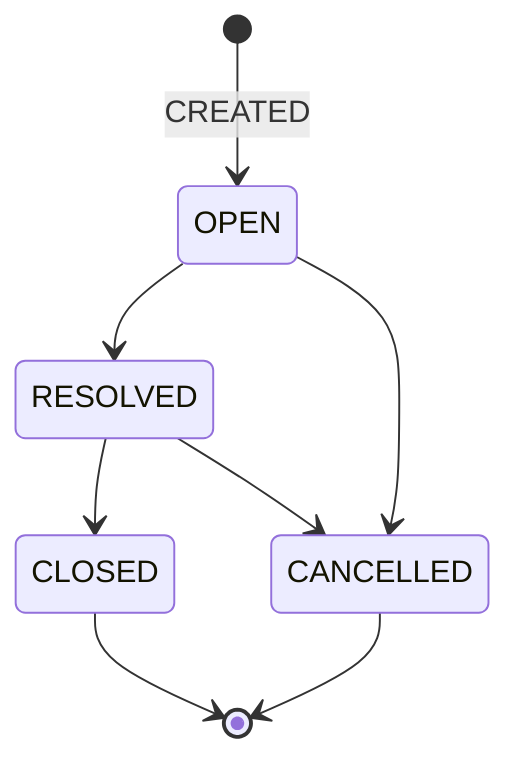

# 🔒 Congelación de Estados y Transiciones

**Gestor de Tickets DATRA — v2.0.0**
**Estado:** CONGELADO (Core del sistema)

Este documento define **de manera definitiva e inmutable**:

* El **ciclo de vida del ticket**
* Las **únicas transiciones válidas**
* Las **reglas de negocio duras** que el backend debe hacer cumplir
* Los **casos límite** que deben ser controlados explícitamente

📌 Nada de lo aquí definido puede quedar a criterio del frontend.
📌 Ninguna excepción es válida en producción.

---

## 1️⃣ Estados oficiales del sistema

El sistema reconoce **exclusivamente** los siguientes estados:

| Estado      | Significado                                    |
| ----------- | ---------------------------------------------- |
| `OPEN`      | Ticket activo, pendiente de resolución         |
| `RESOLVED`  | Incidente resuelto técnicamente                |
| `CLOSED`    | Ticket cerrado administrativa y operativamente |
| `CANCELLED` | Ticket cancelado antes de cierre               |

📌 No existen estados intermedios.
📌 No existen estados temporales.
📌 El frontend no interpreta ni redefine estados.

---

## 2️⃣ Diagrama formal — Ciclo de vida del Ticket

### Representación lógica canónica



📌 `CLOSED` y `CANCELLED` son **estados terminales**.

---

## 3️⃣ Transiciones permitidas (únicas válidas)

| Estado actual | Nuevo estado | Condición                          |
| ------------- | ------------ | ---------------------------------- |
| —             | `OPEN`       | Creación de ticket                 |
| `OPEN`        | `RESOLVED`   | Resolución técnica                 |
| `RESOLVED`    | `CLOSED`     | Cierre administrativo              |
| `OPEN`        | `CANCELLED`  | Cancelación justificada            |
| `RESOLVED`    | `CANCELLED`  | Cancelación posterior a resolución |

📌 No existe ninguna otra transición válida.

---

## 4️⃣ Transiciones prohibidas (reglas duras)

Las siguientes transiciones **deben ser rechazadas por el backend**, sin excepción:

| Origen      | Destino    | Motivo                    |
| ----------- | ---------- | ------------------------- |
| `OPEN`      | `CLOSED`   | Omite resolución          |
| `RESOLVED`  | `OPEN`     | No existe reapertura      |
| `CLOSED`    | cualquiera | Estado final              |
| `CANCELLED` | cualquiera | Estado final              |
| `CANCELLED` | `CLOSED`   | Inconsistencia de dominio |

📌 No hay reapertura de tickets.
📌 Los errores se corrigen con **nuevos tickets**, no mutando estados.

---

## 5️⃣ Reglas explícitas por acción

### 🟢 Crear Ticket

* Estado inicial: `OPEN`
* Evento: `CREATED`
* Se define `openedAt`
* Se persiste `createdAt`

📌 Todo ticket **nace en OPEN**.

---

### 🔵 Resolver Ticket

**Transición:** `OPEN → RESOLVED`

**Requisitos:**

* Ticket en estado `OPEN`
* Usuario autenticado
* Información mínima de resolución

**Acciones backend:**

* Cambio de estado
* Evento `STATUS_CHANGED`
* Registro de timestamp de resolución

📌 Resolver es una acción **técnica**, no administrativa.

---

### 🟣 Cerrar Ticket

**Transición:** `RESOLVED → CLOSED`

**Requisitos:**

* Ticket en estado `RESOLVED`
* Usuario autorizado

**Acciones backend:**

* Cambio de estado
* Seteo de `closedAt`
* Evento `CLOSED`

📌 Un ticket cerrado es **inmutable**.

---

### 🔴 Cancelar Ticket

**Transiciones válidas:**

* `OPEN → CANCELLED`
* `RESOLVED → CANCELLED`

**Requisitos:**

* Ticket no cerrado
* Justificación obligatoria

**Acciones backend:**

* Cambio de estado
* Seteo de `cancelledAt`
* Evento `CANCELLED`

📌 Cancelar **no borra** información.
📌 El historial permanece íntegro.

---

## 6️⃣ Control por rol (regla de dominio)

| Acción                | Permitido           |
| --------------------- | ------------------- |
| Crear ticket          | Usuario autenticado |
| Resolver ticket       | Técnico / Ingeniero |
| Cerrar ticket         | Técnico / Admin     |
| Cancelar ticket       | Admin / Autorizado  |
| Editar ticket activo  | Técnico             |
| Editar ticket cerrado | ❌                   |
| Modificar historial   | ❌                   |

📌 El backend valida todas las reglas.
📌 El frontend **no decide**.

---

## 7️⃣ Casos límite obligatorios

### Caso 1 — Cierre directo

```
OPEN → CLOSED
```

❌ Rechazado. Debe pasar por `RESOLVED`.

---

### Caso 2 — Cancelación tardía

```
CLOSED → CANCELLED
```

❌ Prohibido. El ticket ya es histórico.

---

### Caso 3 — Reapertura

```
CLOSED → OPEN
CANCELLED → OPEN
```

❌ No existe. Se crea un nuevo ticket.

---

### Caso 4 — Correcciones post-cierre

✔ Permitidas solo para:

* Campos no críticos
* Correcciones administrativas

📌 Siempre generan evento `UPDATED`.

---

### Caso 5 — Error humano grave

* No se corrige el estado
* Se documenta en historial
* Se crea un nuevo ticket

---

## 8️⃣ Principios no negociables

1. El ciclo de vida es finito
2. Los estados terminales no mutan
3. No se reabre: se crea nuevo ticket
4. El historial es append-only
5. Backend manda, frontend obedece

---

## 🔒 Estado del artefacto

📌 Estados y transiciones **CONGELADOS**
📌 Reglas listas para implementación técnica
📌 A prueba de auditoría, KPIs y operación real
