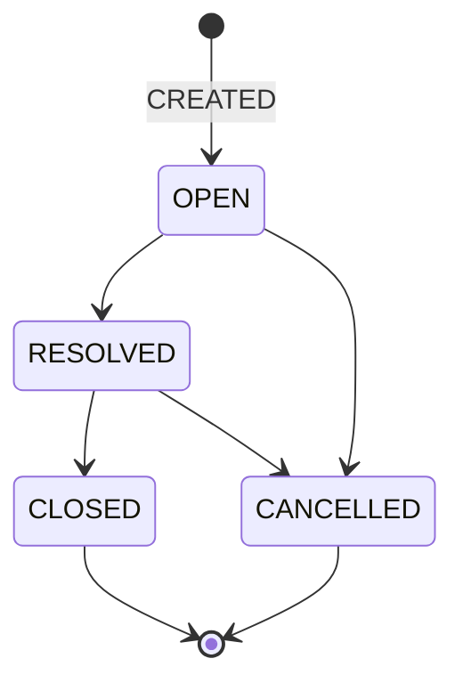

---

# 🔒 Congelación de Estados y Reglas de Transición

**Gestor de Tickets DATRA — v2.0.0**

**Estado:** CONGELADO (Core del sistema)

Este documento define **de manera definitiva e inmutable**:

* El **ciclo de vida del ticket**
* Las **únicas transiciones válidas**
* Las **reglas de negocio duras** que el backend debe hacer cumplir
* Los **casos límite** que deben ser controlados explícitamente

📌 Nada de lo aquí definido puede quedar a criterio del frontend.
📌 Ninguna excepción es válida en producción.

---

## 1️⃣ Estados oficiales del sistema

El sistema reconoce **exclusivamente** los siguientes estados:

| Estado      | Significado                                    |
| ----------- | ---------------------------------------------- |
| `OPEN`      | Ticket activo, pendiente de resolución         |
| `RESOLVED`  | Incidente resuelto técnicamente                |
| `CLOSED`    | Ticket cerrado administrativa y operativamente |
| `CANCELLED` | Ticket cancelado antes del cierre              |

📌 No existen estados intermedios.
📌 No existen estados temporales.
📌 El frontend no interpreta ni redefine estados.

---

## 2️⃣ Diagrama formal — Ciclo de vida del Ticket

### Representación lógica canónica



📌 `CLOSED` y `CANCELLED` son **estados terminales**.

---

## 3️⃣ Transiciones permitidas (únicas válidas)

| Estado actual | Nuevo estado | Condición                          |
| ------------- | ------------ | ---------------------------------- |
| —             | `OPEN`       | Creación del ticket                |
| `OPEN`        | `RESOLVED`   | Resolución técnica                 |
| `RESOLVED`    | `CLOSED`     | Cierre administrativo              |
| `OPEN`        | `CANCELLED`  | Cancelación justificada            |
| `RESOLVED`    | `CANCELLED`  | Cancelación posterior a resolución |

📌 **No existe ninguna otra transición válida.**

---

## 4️⃣ Transiciones prohibidas (reglas duras)

Las siguientes transiciones **deben ser rechazadas por el backend**, sin excepción:

| Origen      | Destino    | Motivo                    |
| ----------- | ---------- | ------------------------- |
| `OPEN`      | `CLOSED`   | Omite resolución técnica  |
| `RESOLVED`  | `OPEN`     | No existe reapertura      |
| `CLOSED`    | cualquiera | Estado terminal           |
| `CANCELLED` | cualquiera | Estado terminal           |
| `CANCELLED` | `CLOSED`   | Inconsistencia de dominio |

📌 No hay reapertura de tickets.
📌 Los errores se corrigen con **nuevos tickets**, no mutando estados.

---

## 5️⃣ Reglas explícitas por acción

---

### 🟢 Crear Ticket

**Estado inicial:** `OPEN`

**Acciones backend:**

* Se crea el ticket en estado `OPEN`
* Se genera evento `CREATED`
* Se define `openedAt`
* Se persiste `createdAt`

📌 Todo ticket **nace en OPEN**.
📌 No existen tickets creados directamente en otro estado.

---

### 🔵 Resolver Ticket

**Transición:** `OPEN → RESOLVED`

**Requisitos:**

* Ticket en estado `OPEN`
* Usuario autenticado con rol permitido
* Información mínima de resolución

**Acciones backend:**

* Cambio de estado a `RESOLVED`
* Seteo de `resolvedAt`
* Evento `STATUS_CHANGED` (`fromStatus=OPEN`, `toStatus=RESOLVED`)

📌 Resolver es una acción **técnica**, no administrativa.
📌 `RESOLVED` **no es un estado terminal**.

---

### 🟣 Cerrar Ticket

**Transición:** `RESOLVED → CLOSED`

**Requisitos:**

* Ticket en estado `RESOLVED`
* Usuario autorizado

**Acciones backend:**

* Cambio de estado a `CLOSED`
* Seteo de `closedAt`
* Evento `CLOSED`

📌 Un ticket cerrado es **inmutable**.
📌 No admite nuevas transiciones.

---

### 🔴 Cancelar Ticket

**Transiciones válidas:**

* `OPEN → CANCELLED`
* `RESOLVED → CANCELLED`

**Requisitos:**

* Ticket no cerrado
* Justificación obligatoria

**Acciones backend:**

* Cambio de estado a `CANCELLED`
* Seteo de `cancelledAt`
* Evento `CANCELLED`

📌 Cancelar **no borra información**.
📌 El historial permanece íntegro.
📌 `CANCELLED` es estado terminal.

---

## 6️⃣ Control por rol (regla de dominio)

| Acción                | Permitido                  |
| --------------------- | -------------------------- |
| Crear ticket          | Usuario autenticado        |
| Resolver ticket       | Técnico / Ingeniero        |
| Cerrar ticket         | Técnico / Admin            |
| Cancelar ticket       | Admin / Usuario autorizado |
| Editar ticket activo  | Técnico / Ingeniero        |
| Editar ticket cerrado | ❌                          |
| Modificar historial   | ❌                          |

📌 El backend valida todas las reglas.
📌 El frontend **no decide ni infiere permisos**.

---

## 7️⃣ Casos límite obligatorios

---

### Caso 1 — Cierre directo

```
OPEN → CLOSED
```

❌ Rechazado.
Debe pasar obligatoriamente por `RESOLVED`.

---

### Caso 2 — Cancelación tardía

```
CLOSED → CANCELLED
```

❌ Prohibido.
El ticket ya es histórico.

---

### Caso 3 — Reapertura

```
CLOSED → OPEN
CANCELLED → OPEN
```

❌ No existe reapertura.
Se crea un **nuevo ticket**.

---

### Caso 4 — Correcciones post-cierre

✔ Permitidas **solo** para:

* Campos no críticos
* Correcciones administrativas

**Condiciones:**

* No cambia estado
* Genera evento `UPDATED`
* No modifica timestamps de ciclo de vida

---

### Caso 5 — Error humano grave

* El estado **no se corrige**
* El error se documenta en historial (`UPDATED` + metadata)
* Se crea un nuevo ticket

📌 El sistema prioriza **trazabilidad**, no conveniencia.

---

## 8️⃣ Compatibilidad futura (v3.0.0)

📌 Este documento **permanece válido en v3.0.0** bajo las siguientes reglas:

* No se agregan nuevos estados al ciclo de vida
* No se modifican transiciones existentes
* Nuevos comportamientos se expresan mediante:

  * Nuevos `eventType` **solo si hay migración formal**
  * O `UPDATED` + metadata estructurada

📌 El core del ciclo de vida **no se versiona**, se preserva.

---

## 9️⃣ Principios no negociables

1. El ciclo de vida es finito
2. Los estados terminales no mutan
3. No se reabre: se crea nuevo ticket
4. El historial es append-only
5. Backend manda, frontend obedece

---

## 🔒 Estado del artefacto

📌 Estados y transiciones **CONGELADOS para v2.0.0**
📌 Alineado con modelo de datos real
📌 Compatible hacia adelante con v3.0.0
📌 Apto para auditoría, KPIs y operación real

---
