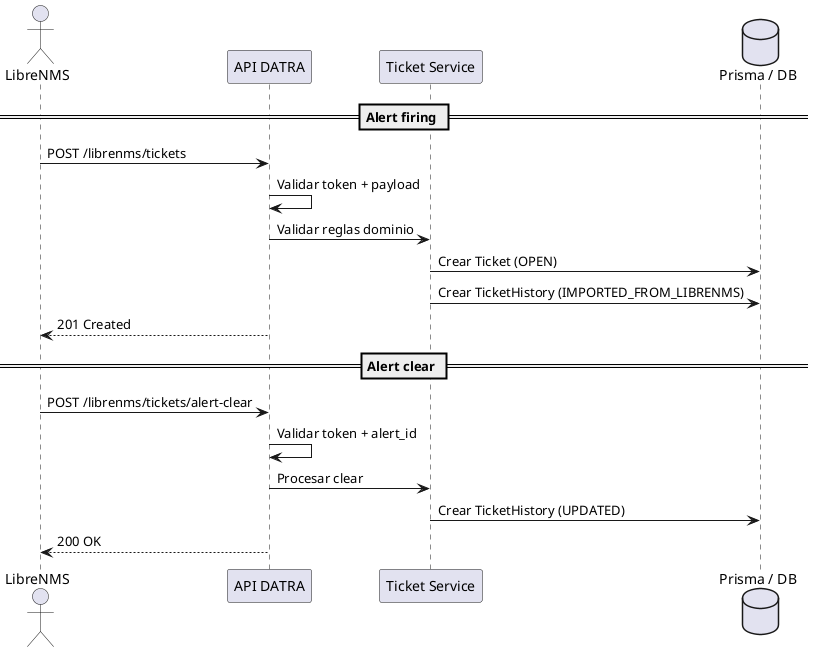

---

## 0️⃣ Alcance del contrato (resumen ejecutivo)

Este contrato define:

1. Cómo LibreNMS **solicita la creación** de un ticket
2. Cómo LibreNMS **notifica que una alerta se recuperó**
3. Qué **sí puede** hacer LibreNMS
4. Qué **NO puede** hacer LibreNMS
5. Qué decisiones son **exclusivas del backend DATRA**

📌 Este documento es **la fuente de verdad** para la integración.

---

## 1️⃣ Principio rector (no negociable)

> **LibreNMS detecta eventos**
> **DATRA gestiona incidentes**

LibreNMS:

* Detecta
* Notifica
* Informa

DATRA:

* Decide
* Audita
* Controla el ciclo de vida

---

## 2️⃣ Tipo de integración (congelado)

### 🔹 Push HTTP (webhooks)

LibreNMS → DATRA

✔ Endpoint dedicado
✔ Payload estructurado
✔ Autenticación por token
✔ Sin acceso a BD
✔ Sin polling

---

## 3️⃣ Endpoints definidos (diseño)

### 3.1 Creación de ticket (alert firing)

```http
POST /api/integrations/librenms/tickets
```

### 3.2 Actualización de alerta (alert clear)

```http
POST /api/integrations/librenms/tickets/alert-clear
```

📌 Son endpoints **separados por intención**, aunque compartan token.

---

## 4️⃣ Payload — Creación de Ticket (alert firing)

*(Se mantiene EXACTAMENTE como lo definiste)*

```json
{
  "alert_id": "123456",
  "alert_name": "Link Down",
  "alert_severity": "critical",
  "alert_state": "firing",
  "device": {
    "hostname": "router-cliente-01",
    "ip": "192.168.10.1",
    "location": "CDMX - Site A"
  },
  "service": {
    "client_rfc": "ABC123456XYZ",
    "service_contract_name": "INTERNET_DEDICADO_1_GB"
  },
  "timestamps": {
    "detected_at": "2026-01-10T14:32:00Z"
  },
  "raw_payload": {}
}
```

---

## 5️⃣ Payload — Actualización de Alerta (alert clear)

### 📦 Payload canónico v1 (alert recovery)

```json
{
  "alert_id": "123456",
  "alert_state": "cleared",
  "cleared_at": "2026-01-10T15:10:00Z",
  "raw_payload": {}
}
```

📌 **alert_id es obligatorio**
📌 No se permite ambigüedad
📌 No se permiten acciones implícitas

---

## 6️⃣ Reglas de validación — alert clear

### 🧱 Validaciones duras (backend)

| Regla                            | Resultado  |
| -------------------------------- | ---------- |
| `alert_id` no existe en DATRA    | ❌ Rechazar |
| Ticket asociado está CANCELLED   | ❌ Rechazar |
| Ticket asociado está CLOSED      | ❌ Rechazar |
| Ticket no es `source = LIBRENMS` | ❌ Rechazar |

📌 **LibreNMS no puede “limpiar” tickets manuales**

---

## 7️⃣ Comportamiento del sistema ante alert clear

### ✅ Lo que SÍ hace DATRA

Cuando recibe un `alert clear` válido:

✔ NO cambia el estado del ticket
✔ NO lo resuelve
✔ NO lo cierra

✔ Registra **evento de historial**

---

### 🧾 Evento de historial generado

```json
{
  "eventType": "UPDATED",
  "fromStatus": "OPEN",
  "toStatus": "OPEN",
  "performedById": null,
  "metadata": {
    "alert_id": "123456",
    "alert_state": "cleared",
    "cleared_at": "2026-01-10T15:10:00Z"
  }
}
```

📌 Append-only
📌 Auditable
📌 KPI-safe

---

## 8️⃣ Decisión clave (explicada para NOC / auditoría)

### ❌ ¿Por qué NO se resuelve automáticamente?

> Porque **resolver ≠ que la alerta desaparezca**

Razones:

* Puede haber intermitencias
* Puede requerir validación humana
* Puede haber impacto residual
* Auditoría exige responsabilidad humana

📌 **Esto no es una limitación técnica**
📌 **Es una decisión operativa profesional**

---

## 9️⃣ Manejo de duplicados (con alert clear)

### Caso A: alerta firing repetida

* Existe ticket OPEN/RESOLVED con `alert_id`
* ❌ No se crea nuevo ticket
* ✔ Se ignora o se registra evento `UPDATED` (futuro)

### Caso B: alert clear sin ticket

* ❌ Rechazado
* ✔ Log de intento

---

## 🔐 10️⃣ Seguridad y control

* Token exclusivo LibreNMS
* Rate limit
* Logging de:

  * Tickets creados
  * Clears recibidos
  * Rechazos
* `raw_payload` opcional (auditoría técnica)

---

## 11️⃣ Qué SÍ puede hacer LibreNMS

✔ Solicitar creación de ticket
✔ Notificar recuperación de alerta
✔ Enviar metadata técnica
✔ Reintentar si falla

---

## 12️⃣ Qué NO puede hacer LibreNMS (congelado)

❌ Resolver tickets
❌ Cerrar tickets
❌ Cancelar tickets
❌ Modificar campos
❌ Cambiar impacto
❌ Reabrir tickets

---

## 13️⃣ Compatibilidad con PDF v1.0.0

✔ Estructura del ticket **no cambia**
✔ El origen puede mostrarse como:

> “Origen del ticket: LibreNMS (automático)”

✔ Historial visible como sección de auditoría

---

## 🧭 Conclusión para tu compañero de LibreNMS

> **LibreNMS notifica eventos**
> **DATRA gobierna incidentes**

Este contrato:

* Define límites claros
* Evita fricción entre sistemas
* Protege auditoría
* Evita automatismos peligrosos
* Deja espacio para evolución futura

---

# 📊 Anexo — Diagrama de Secuencia

**Integración LibreNMS → Gestor de Tickets DATRA**

**Versión:** v1.0
**Estado:** CONGELADO (Diseño)
**Alcance:** Creación de ticket + notificación de recuperación de alerta

---

## 1️⃣ Participantes

| Actor              | Rol                       |
| ------------------ | ------------------------- |
| **LibreNMS**       | Sistema de monitoreo      |
| **API DATRA**      | Backend Gestor de Tickets |
| **Ticket Service** | Lógica de dominio         |
| **Prisma / DB**    | Persistencia              |
| **TicketHistory**  | Auditoría y métricas      |

---

## 2️⃣ Flujo A — Alerta activa (alert firing → creación de ticket)

### 🔁 Secuencia lógica

```
LibreNMS
   |
   | 1. Detecta alerta (firing)
   |
   | 2. POST /integrations/librenms/tickets
   |    (payload alerta)
   |
   v
API DATRA
   |
   | 3. Valida token
   | 4. Valida payload
   | 5. Valida cliente y servicio
   | 6. Verifica duplicados (alert_id)
   |
   v
Ticket Service
   |
   | 7. Aplica reglas de dominio
   | 8. Decide crear ticket
   |
   v
Prisma / DB
   |
   | 9. Inserta Ticket (status = OPEN, source = LIBRENMS)
   |
   | 10. Inserta TicketHistory:
   |     eventType = IMPORTED_FROM_LIBRENMS
   |
   v
API DATRA
   |
   | 11. Responde 201 Created
   |
   v
LibreNMS
```

---

### 📌 Puntos críticos (anotación de diseño)

* LibreNMS **no controla el resultado**
* DATRA puede rechazar sin romper el flujo
* El ticket **nace siempre OPEN**
* Auditoría se genera automáticamente

---

## 3️⃣ Flujo B — Alerta recuperada (alert clear → evento de historial)

### 🔁 Secuencia lógica

```
LibreNMS
   |
   | 1. Detecta alerta recuperada (cleared)
   |
   | 2. POST /integrations/librenms/tickets/alert-clear
   |    (alert_id, timestamps)
   |
   v
API DATRA
   |
   | 3. Valida token
   | 4. Valida alert_id
   | 5. Busca ticket asociado
   | 6. Valida estado del ticket
   |
   v
Ticket Service
   |
   | 7. Decide NO cambiar estado
   | 8. Registra evento de auditoría
   |
   v
Prisma / DB
   |
   | 9. Inserta TicketHistory:
   |    eventType = UPDATED
   |    metadata.alert_state = cleared
   |
   v
API DATRA
   |
   | 10. Responde 200 OK
   |
   v
LibreNMS
```

---

### 📌 Puntos críticos

* ❌ No se cambia estado
* ❌ No se resuelve automáticamente
* ✔ Se conserva trazabilidad
* ✔ KPI-safe

---

## 4️⃣ Casos alternos (errores controlados)

### ❌ Duplicado de alerta activa

```
LibreNMS → API DATRA
API DATRA → 409 Conflict
```

📌 No se crea nuevo ticket
📌 Puede loguearse intento

---

### ❌ Alert clear sin ticket

```
LibreNMS → API DATRA
API DATRA → 404 Not Found
```

📌 No existe ticket asociado
📌 Auditoría de intento fallido

---

## 5️⃣ Diagrama PlantUML (opcional)



---
